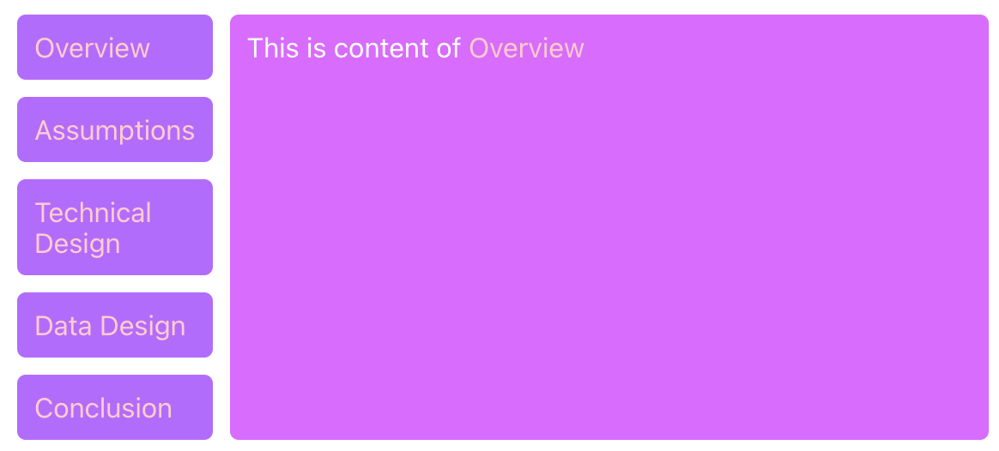
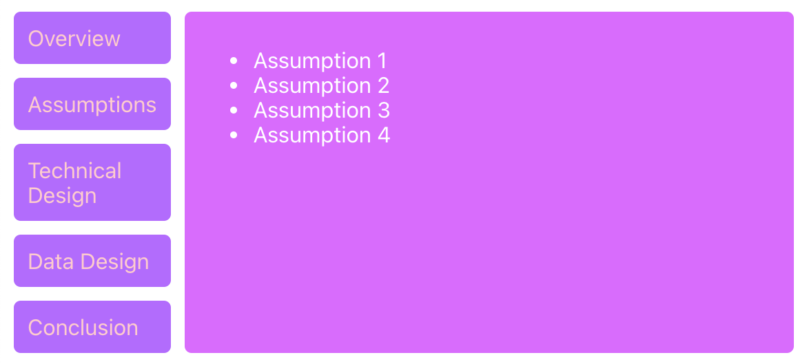

# reactjs-tabbedpane-component

> A tabbed pane component using React.js

[](https://www.npmjs.com/package/reactjs-tabbedpane-component) [](https://standardjs.com)

## Install

```bash
npm install --save reactjs-tabbedpane-component
```

## Usage

```jsx
import React, { Component } from 'react'

import TabbedPane from 'reactjs-tabbedpane-component'
import 'reactjs-tabbedpane-component/dist/index.css'

const contentData = {
  contents: [
    {
      subject: 'Overview',
      text: 'This is content of Overview'
    },
    {
      subject: 'Assumptions',
      text: '<ul><li>Assumption 1</li><li>Assumption 2</li><li>Assumption 3</li><li>Assumption 4</li></ul>'
    },
    {
      subject: 'Technical Design',
      text: 'This is content of Technical Design'
    }
  ]
}

class Example extends Component {
  render() {
    return <TabbedPane data={contentData} />
  }
}
```





## API

`<TabbedPane>`

### props

* *data*: JSON defining the tabs.  HTML tags are supported.

## License

MIT © [adafycheng](https://github.com/adafycheng)
